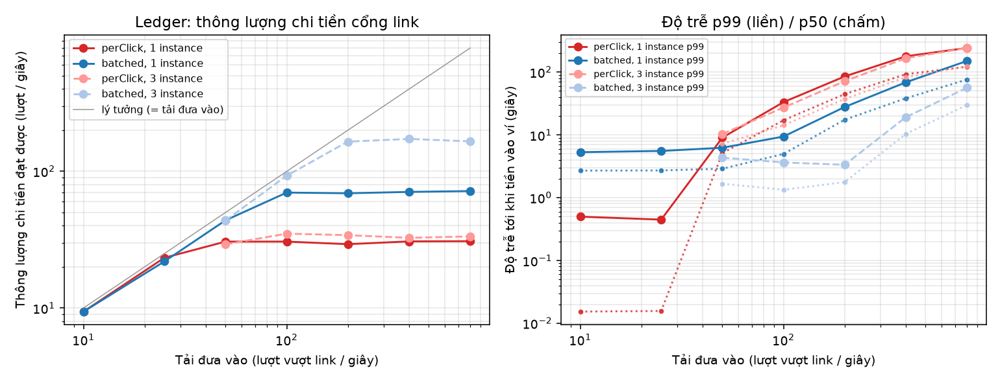
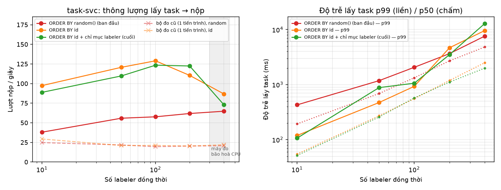

# NC-B-06 — Thí nghiệm hiệu năng có giả thuyết

> Thí nghiệm cho mục **NC-B-06** ([sổ vấn đề](../van-de-can-giai-quyet.md)). Mã đo: [experiments/perf](../../experiments/perf). Số liệu thô: `experiments/perf/ket-qua/*.json`.
>
> Hai câu hỏi:
> 1. **Chi tiền cổng link (VD-M-08):** ghi sổ cái từng lượt (`perClick`) so với gộp lô (`batched`).
> 2. **Phân phối task (VD-T-06):** lấy task bằng `FOR UPDATE SKIP LOCKED` có đúng và có mở rộng theo số labeler không.

Môi trường: một laptop 16 nhân (Windows 11, Docker Desktop/WSL2). Mọi service, Postgres, RabbitMQ **và bộ sinh tải** chạy chung một máy. Mục 4 nói rõ việc này ảnh hưởng tới số liệu thế nào.

## 1. Chi tiền cổng link: perClick so với batched

### 1.1 Giả thuyết

- **H1:** `perClick` bão hoà sớm. Mỗi lượt là một transaction dưới **khoá sổ cái toàn cục** (chuỗi băm bút toán), nên thông lượng bị chặn ở 1 / (thời gian một transaction), bất kể tải hay số instance.
- **H2:** `batched` đẩy điểm bão hoà lên nhiều lần, vì đường nóng chỉ còn INSERT một dòng `gate_clicks`. Bút toán viết một lần cho cả lô: mỗi dự án một bút toán, mỗi cặp (người chia sẻ, link) một khoản treo. Đổi lại, độ trễ tiền vào ví tăng thêm khoảng một chu kỳ gộp.

### 1.2 Cách đo

Môi trường cô lập, không đụng dữ liệu dev:

- vhost RabbitMQ `bench`, database `ledger_bench`, một hoặc ba instance ledger-svc riêng (cổng 8195+);
- dự án và ký quỹ khởi tạo bằng **event thật** (`deposit.confirmed` → `project.publish_requested` → `project.published`), không chèn tay;
- bộ đo phát `click.validated` với tốc độ cố định 10 … 800 lượt/giây trong 15 giây;
- chu kỳ gộp lô đặt 5 giây (`ledger.gate_batch_interval`; mặc định trên hệ thống là 60 giây).

Các đại lượng đo:

- **Độ trễ:** từ lúc gate xác nhận tới lúc tiền vào ví (`holds.held_at` / `gate_clicks.settled_at`).
- **Thông lượng:** số lượt đã chi chia cho thời gian.
- **Độ sâu hàng đợi:** lấy mẫu mỗi 0,5 giây.
- **Số phiên Postgres chờ khoá:** đếm trong `pg_stat_activity`.

Chạy lại: `cd experiments/perf && ../.venv/Scripts/python ledger_cpm.py --mode perClick --mode batched [--so-instance 3]`.

### 1.3 Kết quả

**Thông lượng chi tiền đạt được (lượt/giây)** ở từng mức tải đưa vào:

| Chế độ | 10 | 25 | 50 | 100 | 200 | 400 | 800 | Chờ khoá trung bình |
|---|---|---|---|---|---|---|---|---|
| perClick, 1 instance | 9,4 | 23,3 | **30,6** | 30,6 | 29,3 | 30,7 | 30,8 | ≈ 0 |
| batched, 1 instance | 9,4 | 21,9 | 43,8 | **69,9** | 69,1 | 70,7 | 71,7 | 0 |
| perClick, 3 instance | — | — | 29,2 | **35,0** | 34,1 | 32,6 | 33,4 | **1,85 – 2,0** |
| batched, 3 instance | — | — | 43,7 | 92,9 | **165,0** | 172,7 | 165,7 | 0,16 – 0,45 |

**Độ trễ tới khi tiền vào ví (p50 / p99, giây)** khi hệ thống **chưa** bão hoà:

| Chế độ | Tải | p50 | p99 |
|---|---|---|---|
| perClick, 1 instance | 25/s | 0,016 | 0,45 |
| batched, 1 instance | 25/s | 2,7 | 5,6 |
| batched, 3 instance | 200/s | 1,8 | 3,3 |

Qua điểm bão hoà, hàng đợi dồn ứ và độ trễ tăng tuyến tính theo thời gian (perClick 800/s: hàng đợi tới 11.444 tin, p99 243 giây).

### 1.4 Kết luận

- **H1 đúng.** perClick dừng ở khoảng **30 lượt/giây**, tức khoảng 33 ms cho mỗi transaction. **Thêm instance không giúp gì** (3 instance: 33–35/s). Trung bình luôn có khoảng 1,9 phiên đứng chờ khoá, đúng hình ảnh "ba consumer xếp hàng sau một khoá sổ cái". Ở 1 instance, số phiên chờ khoá ≈ 0 vì chỉ có một consumer, chứ không phải vì không có khoá.
- **H2 đúng.** batched đạt **~70/s trên một instance**, gấp 2,3 lần. Quan trọng hơn, batched **mở rộng ngang**: 3 instance đạt **165–173/s**, gấp 5 lần perClick với cùng số instance. Đường nóng không còn khoá chung, nên trần của một instance (ước tính khoảng 14 ms cho một tin: INSERT + `processed_events` + commit) nhân lên theo số consumer.
- **Cái giá:** độ trễ tiền vào ví từ khoảng 16 ms thành khoảng một nửa chu kỳ gộp (chu kỳ 5 giây cho p50 khoảng 2,7 giây). Với chu kỳ mặc định 60 giây, người chia sẻ thấy tiền chậm tối đa khoảng 1 phút. Tiền cổng link vốn **treo** chờ kỳ đối soát, nên độ trễ này không ảnh hưởng gì tới người dùng.

**Trên hệ thống:** setting `ledger.gate_payout_mode` ∈ {`perClick` (mặc định), `batched`}, `ledger.gate_batch_interval` (60 giây), `ledger.gate_batch_size` (5.000). **Khuyến nghị** chuyển sang `batched` khi tải cổng link vượt khoảng 20 lượt/giây trên mỗi instance ledger.

**Ghi nhận khi đo:** lô đầu tiên sau khi ledger khởi động bị chậm tới 60 giây dù setting đặt 5 giây. Nguyên nhân là vòng chờ đầu tiên của `GateBatchWorker` đọc chu kỳ trước khi bản sao setting kịp đồng bộ, nên dùng giá trị mặc định. Mức đo bị ảnh hưởng (batched ×3, 25/s) đã được tách ra (trường `lam_nong` trong JSON) và không đưa vào bảng. **Đã sửa:** mọi worker chạy theo chu kỳ setting giờ chờ qua `ChoTheoSetting`, đọc lại chu kỳ mỗi giây (cùng lỗi có ở 9 worker C# và 2 vòng lặp của quality-svc).

## 2. Phân phối task

### 2.1 Giả thuyết

- **H3:** lấy task bằng `SELECT … FOR UPDATE SKIP LOCKED` **không bao giờ** cấp trùng: mỗi cặp (task, labeler) tối đa một lượt, và số lượt nộp của một task không vượt redundancy, ở mọi mức đồng thời.
- **H4:** thông lượng tăng theo số labeler cho tới khi chạm trần **pool kết nối Postgres** của task-svc (20 kết nối ở dev). Sau đó thông lượng đứng yên còn độ trễ tăng tuyến tính.

### 2.2 Cách đo

- Mỗi lần đo tạo một dự án mới: 20.000 mẫu văn bản, phân loại 2 lớp, redundancy 3, không trộn câu vàng.
- 400 labeler đăng ký thật qua identity-svc và tham gia dự án.
- N labeler (10 … 400) cùng lặp "lấy task → nộp ngay" trong 30 giây, gọi **thẳng** task-svc.
- Sau mỗi lần đo, kiểm H3 bằng SQL trên `task_db`.

Chạy lại: `cd experiments/perf && ../.venv/Scripts/python task_lease.py --muc 10,50,100,200,400 --giay 30 --tien-trinh 8 --ra task-lease.json`.

### 2.3 Sai lầm phương pháp đã sửa

Lần đo đầu dùng **một tiến trình Python** sinh tải, cho kết quả khoảng **20 lượt/giây ở mọi mức**, từ 10 tới 400 labeler. Kết luận ban đầu là "câu `ORDER BY random()` là trần". Nhưng khi đã sửa câu truy vấn, con số vẫn không đổi (29 → 21 → 21 → 20 → 22). Chẩn đoán lúc đang chạy tải cho thấy:

- tiến trình sinh tải dùng **100% một nhân** CPU;
- task-svc chỉ dùng **~27% một nhân**;
- Postgres gần như rảnh (18,7 trên 20 kết nối idle).

Trần 20/s là trần của **công cụ đo**. Bộ đo được sửa thành 8 tiến trình, mỗi tiến trình một event loop và client riêng. Mỗi mức đo giờ ghi kèm `cpu_client_max`, tức CPU lớn nhất của một tiến trình sinh tải. Ở mọi mức con số này ≤ 0,73 nhân, nên client không còn bão hoà. Số liệu cũ được giữ trong `task-lease-mot-tien-trinh.json` (đường gạch trên biểu đồ) để đối chiếu.

### 2.4 Hai nút thắt trong câu lấy task

Câu lấy task có hai phần đắt, cả hai đều được tìm ra bằng `EXPLAIN ANALYZE` trên dữ liệu bench:

| # | Vấn đề | Trước | Sau | Sửa |
|---|---|---|---|---|
| 1 | `ORDER BY random()`: Postgres đọc **và sắp xếp** mọi task ứng viên của dự án mỗi lần lấy (sắp xếp tràn đĩa 3,6 MB) | 82 ms (dự án 20.000 mẫu) | 2,1 ms | `ORDER BY t.id`: đi theo chỉ mục `ix_tasks_pool`, dừng ở dòng **đầu tiên** thoả điều kiện. SKIP LOCKED vẫn giúp các request đồng thời không tranh cùng dòng |
| 2 | `NOT EXISTS` ("labeler này đã giữ / nộp task này chưa"): chỉ mục có sẵn bắt đầu bằng `task_id`, nên Postgres **quét tuần tự cả bảng assignments** | 28 ms (34.000 lượt; tăng theo số lượt đã giao) | 2,2 ms | Chỉ mục mới `ix_assignments_labeler_active (labeler_id, task_id) WHERE state IN ('Leased','Submitted')`. Postgres chuyển sang Merge Anti Join, chỉ đọc 32 dòng của labeler (migration `ChiMucLabelerLayTask`) |

### 2.5 Kết quả (bộ đo 8 tiến trình)

**Thông lượng (lượt nộp/giây)** và **độ trễ lấy task p50 / p99 (ms)** theo số labeler đồng thời:

| Labeler | `random()` (ban đầu) | `ORDER BY id` | `ORDER BY id` + chỉ mục labeler (bản cuối) |
|---|---|---|---|
| 10 | 38,0 — 194 / 429 | 97,4 — 55 / 119 | 88,8 — 52 / 107 |
| 50 | 55,8 — 688 / 1.179 | 120,7 — 271 / 473 | 109,7 — 257 / 881 |
| 100 | 57,6 — 1.331 / 2.063 | **129,0** — 556 / 930 | **123,4** — 573 / 1.061 |
| 200 | 61,8 — 2.703 / 3.656 | 110,4 — 1.190 / 4.674 | **122,4** — 1.112 / 3.505 |
| 400 ¹ | 64,7 — 4.822 / 7.606 | 86,8 — 2.501 / 9.586 | 73,1 — 1.991 / 12.882 |

¹ Ở mức 400 **cả máy đo bão hoà CPU (100%)**: 8 tiến trình sinh tải dùng khoảng 5,3 nhân, Postgres của task khoảng 3,2 nhân, cộng một container ngoài dự án đang chạy (khoảng 1,1 nhân). task-svc lúc đó chỉ dùng khoảng 0,6–1 nhân. Con số ở mức này phản ánh giới hạn của **máy đo**, không phải của task-svc.

**Kiểm tra đúng đắn (H3), cả năm lần đo:**

| Lần đo | Lượt nộp | Cấp trùng (task, labeler) | Task nộp vượt redundancy |
|---|---|---|---|
| random(), 1 tiến trình | 3.208 | 0 | 0 |
| id, 1 tiến trình | 3.409 | 0 | 0 |
| random(), 8 tiến trình | 8.336 | 0 | 0 |
| id, 8 tiến trình | 16.329 | 0 | 0 |
| id + chỉ mục, 8 tiến trình | 15.522 | 0 | 0 |

### 2.6 Kết luận

- **H3 đúng.** 46.804 lượt nộp, 0 cấp trùng, 0 vượt redundancy, 0 lỗi HTTP, ở mọi mức tới 400 labeler đồng thời.
- **H4 sai.** Pool kết nối **không bao giờ cạn**: lấy mẫu `pg_stat_activity` cho thấy vẫn còn 4–10 trên 20 kết nối rảnh ở mức 200–400 labeler. Trần thật nằm ở hai chỗ:
  1. **Chi phí câu lấy task** (mục 2.4). Sửa xong, thông lượng tăng khoảng **2 lần** (58 → 123 lượt/giây ở 100 labeler), độ trễ lấy task p50 giảm 2,3–3,7 lần.
  2. **Ghi WAL lúc COMMIT.** Sau khi sửa, trung bình khoảng 2–2,5 phiên đứng chờ `WALWrite` / `WALSync`. Mỗi lần lấy và mỗi lần nộp là một commit riêng có fsync, trên đĩa ảo của Docker Desktop.
- **Chỉ mục labeler** gần như không đổi thông lượng ở 10–100 labeler, vì lúc đầu bảng assignments còn nhỏ. Tác dụng của nó là giữ chi phí **không tăng theo thời gian**: không có chỉ mục, mỗi lần lấy task quét toàn bộ lượt đã giao của mọi dự án. Ở mức 200, bản có chỉ mục giữ được 122/s, bản không có tụt còn 110/s.
- Ở 200 labeler, mỗi người nộp khoảng 0,6 nhãn/giây, nhanh hơn nhiều so với một người gán nhãn thật (khoảng một nhãn mỗi vài giây). 120 lượt/giây tương đương vài nghìn labeler thật làm cùng lúc trên một instance task-svc.

### 2.7 Thứ tự FIFO và cửa sổ ngẫu nhiên

`ORDER BY t.id` cấp task **cũ nhất trước**. Với redundancy 3, những labeler bấm cùng lúc thường rơi vào **cùng một task**, trong khi bản `random()` cũ rải họ ra khắp dự án. Hệ quả là tranh khoá dòng khi nộp nhiều hơn (khoảng 0,35 phiên chờ `Lock:transactionid` ở 200 labeler), và một nhóm tài khoản bấm cùng lúc dễ cùng nhận một mẫu để thống nhất đáp án sai (VD-Q-02).

**Đã xử lý bằng cửa sổ ngẫu nhiên** (setting `task.lease_candidate_window`, mặc định 32):

- Truy vấn con lấy N ứng viên đầu hàng theo chỉ mục, **không khoá**.
- Truy vấn ngoài sắp ngẫu nhiên ≤ N dòng rồi khoá **một** dòng bằng SKIP LOCKED. `LockRows` nằm trên `Sort`, nên chỉ dòng được chọn bị khoá.
- Cả N dòng đang bị giữ thì rơi về câu FIFO.
- Không dùng `OFFSET` ngẫu nhiên, vì Postgres **khoá cả các dòng bị OFFSET bỏ qua** khiến request khác tưởng hết task.

| Kiểm tra | Kết quả |
|---|---|
| 4 labeler bấm liên tiếp trên dự án 40 mẫu, redundancy 3 (E2E, 3 vòng / 6 vòng) | cửa sổ 1 (FIFO): luôn 2 task khác nhau; cửa sổ 32: ≥ 18 / 24 task khác nhau |
| Thông lượng, dự án 5.000 mẫu (`task-lease-cua-so.json`) | 93 / 104 / 127 / 95 lượt/giây ở 10 / 50 / 100 / 200 labeler; FIFO: 89 / 110 / 123 / 122 |
| H3 | 12.605 lượt nộp, 0 cấp trùng, 0 vượt redundancy |

**Mức 200 labeler thấp hơn không do cửa sổ.** `EXPLAIN` ngay sau lần đo cho thấy **cả câu FIFO lẫn câu cửa sổ** đều mất 7–20 ms, đọc khoảng 1.100 trang dữ liệu. Nguyên nhân là bảng `tasks` có 14.722 dòng chết: task chuyển Open → Completed để lại mục chỉ mục cũ, dồn ở **đầu hàng** (task cũ xong trước). Sau `VACUUM`, cùng câu đó chỉ đọc 10 trang, mất 3,6 ms. Autovacuum mặc định chỉ dọn khi dòng chết vượt 20% bảng. Hướng tiếp theo là đặt autovacuum riêng cho bảng `tasks` dày hơn (ví dụ `autovacuum_vacuum_scale_factor = 0.01`).

## 3. Thay đổi đã đưa vào hệ thống

| Thành phần | Thay đổi |
|---|---|
| ledger-svc | Chế độ chi `batched`: bảng `gate_clicks`, `GateBatchWorker`, bút toán `clickbatch:{lô}:{dự án}`; setting `ledger.gate_payout_mode`, `ledger.gate_batch_interval`, `ledger.gate_batch_size` |
| task-svc | Câu lấy task: ngẫu nhiên trong cửa sổ N task đầu hàng (`task.lease_candidate_window`) thay `ORDER BY random()` trên cả dự án; chỉ mục `ix_assignments_labeler_active` (migration `ChiMucLabelerLayTask`) |

## 4. Giới hạn

- **Một máy.** Client, mọi service, Postgres và RabbitMQ chung 16 nhân, ổ đĩa ảo của Docker Desktop. Con số tuyệt đối sẽ khác trên máy chủ thật, đặc biệt là phần chờ fsync khi commit. So sánh **tương đối** giữa các phiên bản thì vẫn có giá trị, vì chúng được đo trong cùng điều kiện.
- **Nhiễu nền.** Trong lúc đo có một container không thuộc dự án đang chạy (khoảng 1 nhân CPU). Mỗi cấu hình chỉ đo một lần, chưa lặp nhiều lần để có khoảng tin cậy. Chênh lệch dưới khoảng 10% giữa hai bản (ví dụ `id` so với `id + chỉ mục` ở 10–100 labeler) nằm trong mức nhiễu.
- **Labeler nộp ngay** không suy nghĩ, nên tải mỗi người cao hơn thực tế rất nhiều. Thông lượng tính theo lượt/giây, không theo số người.
- **Ledger đo 15 giây mỗi mức.** Ở 800/s, perClick không chi hết trong cửa sổ đo (7.847/12.000 lượt), nên thông lượng được tính trên số lượt đã chi.
