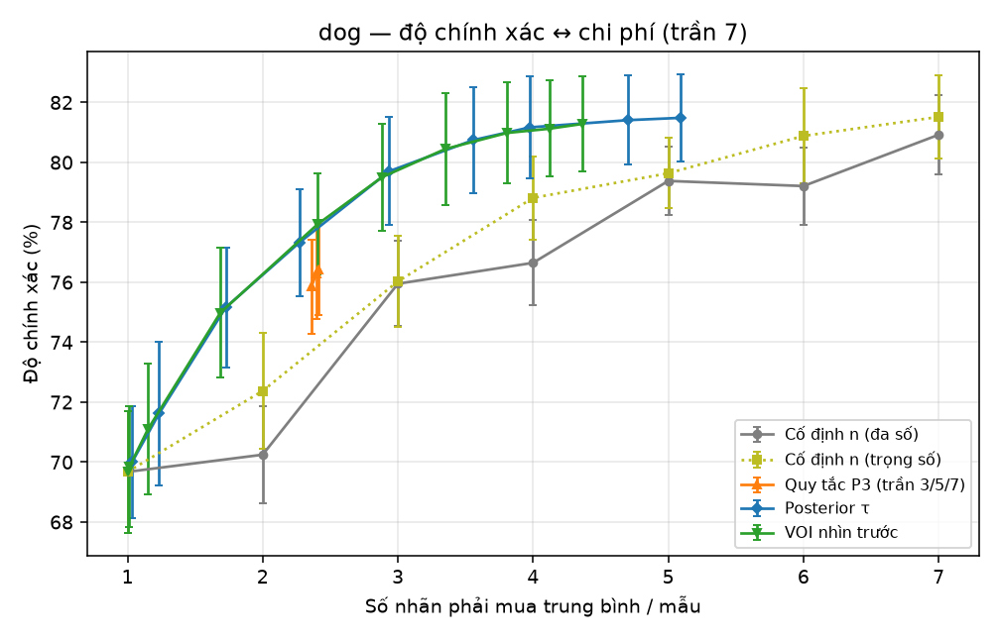
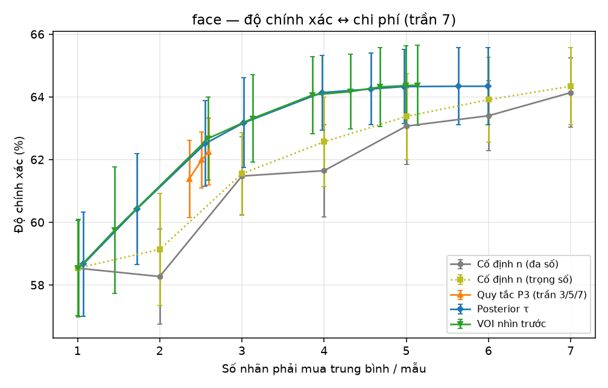
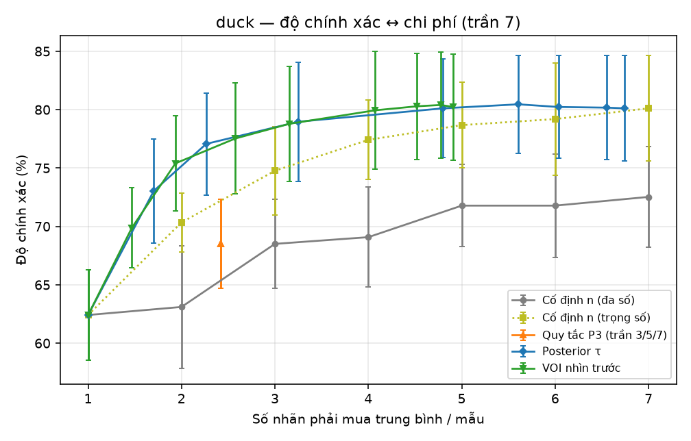
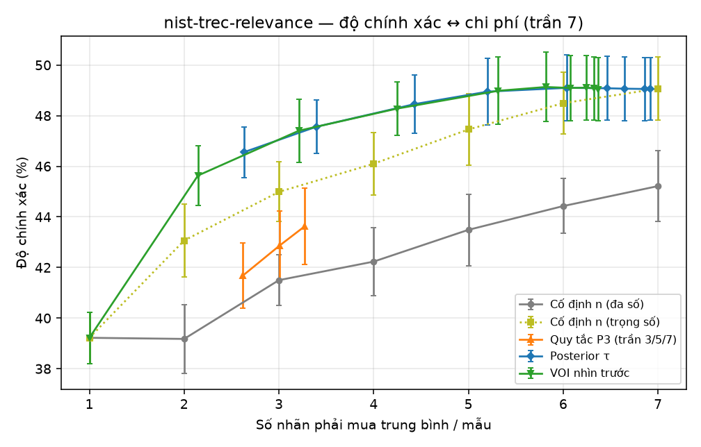
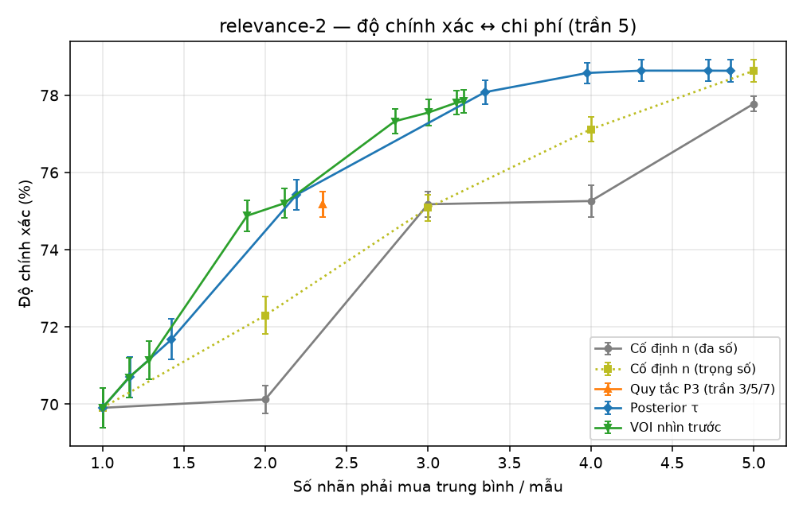
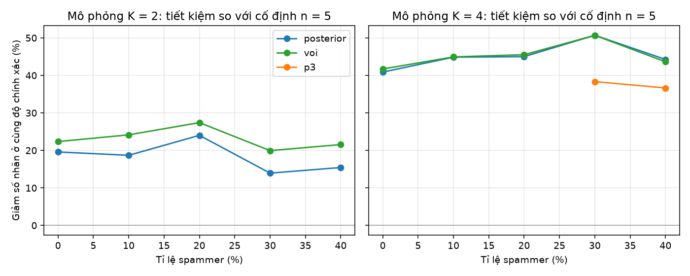

# NC-D-01 — Redundancy thích ứng: dừng tối ưu so với redundancy cố định

> Thí nghiệm cho mục **NC-D-01** ([sổ vấn đề](../van-de-can-giai-quyet.md)). Mã nguồn: [experiments/redundancy](../../experiments/redundancy).
> Hàm quyết định dùng trong thí nghiệm **chính là** hàm quality-svc đang chạy: [services/quality/app/redundancy.py](../../services/quality/app/redundancy.py). Bật trên hệ thống bằng setting `quality.redundancy_policy`.

## 1. Câu hỏi

Mỗi nhãn mua thêm tốn tiền (đơn giá + phí). Với một mẫu, **nên dừng ở nhãn thứ mấy**?

- **Cố định n** (cách phổ biến): luôn mua n nhãn rồi bỏ phiếu đa số.
- **Quy tắc P3 hiện tại** (`majority`): bắt đầu 2 nhãn; không lựa chọn nào quá bán thì mua thêm 1, tới trần.
- **Posterior** (`posterior`): sau mỗi nhãn tính xác suất hậu nghiệm của từng đáp án, có **trọng số theo độ chính xác từng người gán** (mô hình "một đồng xu"). Dừng khi đáp án dẫn đầu đạt ngưỡng τ.
- **VOI nhìn trước** (`voi`): coi đây là **bài toán dừng tối ưu**. Chỉ mua thêm nếu tồn tại m nhãn nữa mà giá trị thông tin kỳ vọng vượt chi phí của m nhãn đó (R = giá trị một nhãn cuối đúng / chi phí một nhãn).

Kết quả cần có: **đường cong độ chính xác ↔ số nhãn phải mua**, quy ra % tiết kiệm so với cố định n = 3/5/7.

## 2. Phương pháp

**Dữ liệu** — 5 bộ crowdsourcing công khai có đáp án thật, cộng mô phỏng có kiểm soát:

| Bộ dữ liệu | Nguồn | Lớp | Mẫu dùng (đủ trần nhãn) | Người gán | Trần |
|---|---|---|---|---|---|
| Dog | Zheng et al. VLDB 2017 | 4 | 807 | 109 | 7 |
| Face | Zheng et al. VLDB 2017 | 4 | 584 | 27 | 7 |
| Duck | Zheng et al. VLDB 2017 | 2 | 108 | 39 | 7 |
| NIST TREC | crowd-kit (Toloka/Yandex, NIST) | 4 | 1124 | 763 | 7 |
| Relevance-2 | crowd-kit (Toloka/Yandex, NIST) | 2 | 8826 | 7054 | 5 |

**Phát lại (replay)**, lặp 20 hạt giống (mô phỏng: 5):

1. 20% mẫu đóng vai **câu vàng**. Độ chính xác của mỗi người gán được ước lượng trên các mẫu này, làm mượt về tiên nghiệm 0,7 với sức nặng 2 — **đúng công thức uy tín của quality-svc**. Người chưa gặp lấy 0,7. Đánh giá chỉ trên 80% còn lại: không dùng đáp án của mẫu đang đánh giá.
2. Mỗi mẫu lấy ngẫu nhiên đủ "trần" nhãn thật, xáo thứ tự để giả lập người gán đến lần lượt. Chính sách đọc dần từng nhãn và quyết định dừng hay mua thêm. **Chi phí = số nhãn đã đọc.**
3. Quét tham số: τ ∈ {0,5 … 0,995}, R ∈ {2 … 1000}, trần P3 ∈ {3, 5, 7}. Mỗi cấu hình là một điểm (chi phí, độ chính xác). "Tiết kiệm" = chi phí nhỏ nhất (nội suy tuyến tính trên đường cong) để đạt **cùng độ chính xác** với cố định n.

**Hai mốc so sánh**, để tách hai nguồn lợi:

- *Cố định n, đa số*: cách làm phổ biến.
- *Cố định n, trọng số*: vẫn n nhãn nhưng gộp theo hậu nghiệm có trọng số. Mốc này tách lợi ích của **dừng sớm** khỏi lợi ích của **biết ai giỏi**.

**Mô phỏng** — cố ý *khác* giả định của mô hình, để chính sách không "thắng vì chính mình đặt luật":

- người làm thật có độ chính xác ~ U(0,6; 0,95);
- spammer (tỉ lệ 0–40%) trả lời ngẫu nhiên;
- **20% mẫu khó** (độ chính xác giảm 0,2), điều mà mô hình một đồng xu không biết;
- 1.500 mẫu, 150 người, 7 nhãn mỗi mẫu.

## 3. Kết quả

### 3.1 Đường cong độ chính xác ↔ chi phí

| | |
|---|---|
|  |  |
|  |  |
|  |  |

Thanh lỗi là ± 1 độ lệch chuẩn qua các hạt giống.

### 3.2 Tiết kiệm so với cố định n (bỏ phiếu đa số)

Số nhãn trung bình mỗi mẫu cần để đạt **cùng độ chính xác**; trong ngoặc là % thay đổi so với n.

| Bộ dữ liệu | Cố định n | Độ chính xác cố định (%) | Posterior: nhãn cần (tiết kiệm) | VOI: nhãn cần (tiết kiệm) | P3 hiện tại |
|---|---|---|---|---|---|
| Dog | 3 | 76.0 | 1.93 (−36%) | 1.92 (−36%) | 2.37 (−21%) |
| Dog | 5 | 79.4 | 2.85 (−43%) | 2.84 (−43%) | không đạt |
| Dog | 7 | 80.9 | 3.73 (−47%) | 3.75 (−46%) | không đạt |
| Face | 3 | 61.5 | 2.14 (−29%) | 2.12 (−29%) | 2.38 (−21%) |
| Face | 5 | 63.1 | 2.95 (−41%) | 2.92 (−42%) | không đạt |
| Face | 7 | 64.1 | 3.97 (−43%) | 4.18 (−40%) | không đạt |
| Duck | 3 | 68.5 | 1.40 (−53%) | 1.38 (−54%) | 2.42 (−19%) |
| Duck | 5 | 71.8 | 1.62 (−68%) | 1.63 (−67%) | không đạt |
| Duck | 7 | 72.5 | 1.67 (−76%) | 1.69 (−76%) | không đạt |
| NIST TREC | 3 | 41.5 | 2.63 (−12%) | 1.41 (−53%) | 2.62 (−13%) |
| NIST TREC | 5 | 43.5 | 2.63 (−47%) | 1.76 (−65%) | 3.22 (−36%) |
| NIST TREC | 7 | 45.2 | 2.63 (−62%) | 2.07 (−70%) | không đạt |
| Relevance-2 | 3 | 75.2 | 2.14 (−29%) | 2.10 (−30%) | 2.35 (−22%) |
| Relevance-2 | 5 | 77.8 | 3.22 (−36%) | 3.16 (−37%) | không đạt |

### 3.3 Tiết kiệm so với cố định n *có trọng số* — chỉ còn lợi ích của việc dừng sớm

| Bộ dữ liệu | Cố định n | Độ chính xác cố định (%) | Posterior: nhãn cần (tiết kiệm) | VOI: nhãn cần (tiết kiệm) | P3 hiện tại |
|---|---|---|---|---|---|
| Dog | 3 | 76.0 | 1.95 (−35%) | 1.94 (−35%) | 2.38 (−21%) |
| Dog | 5 | 79.6 | 2.92 (−42%) | 2.95 (−41%) | không đạt |
| Dog | 7 | 81.5 | không đạt | không đạt | không đạt |
| Face | 3 | 61.5 | 2.17 (−28%) | 2.15 (−28%) | 2.40 (−20%) |
| Face | 5 | 63.4 | 3.22 (−36%) | 3.19 (−36%) | không đạt |
| Face | 7 | 64.3 | 5.64 (−19%) | 4.84 (−31%) | không đạt |
| Duck | 3 | 74.8 | 1.94 (−35%) | 1.88 (−37%) | không đạt |
| Duck | 5 | 78.7 | 3.10 (−38%) | 3.10 (−38%) | không đạt |
| Duck | 7 | 80.1 | 4.80 (−31%) | 4.29 (−39%) | không đạt |
| NIST TREC | 3 | 45.0 | 2.63 (−12%) | 2.03 (−32%) | không đạt |
| NIST TREC | 5 | 47.5 | 3.31 (−34%) | 3.27 (−35%) | không đạt |
| NIST TREC | 7 | 49.1 | 5.85 (−16%) | 5.59 (−20%) | không đạt |
| Relevance-2 | 3 | 75.1 | 2.12 (−29%) | 2.03 (−32%) | 2.35 (−22%) |
| Relevance-2 | 5 | 78.6 | 4.29 (−14%) | không đạt | không đạt |

### 3.4 So với quy tắc P3 đang chạy

| Bộ dữ liệu | P3: độ chính xác @ số nhãn | Posterior cùng số nhãn | VOI cùng số nhãn | Độ chính xác cao nhất P3 / Posterior |
|---|---|---|---|---|
| Dog | 76.4 @ 2.41 | 77.8 | 78.0 | 76.4 / 81.5 |
| Face | 62.3 @ 2.59 | 62.6 | 62.7 | 62.3 / 64.3 |
| Duck | 68.5 @ 2.42 | 77.4 | 77.0 | 68.5 / 80.5 |
| NIST TREC | 43.6 @ 3.27 | 47.4 | 47.5 | 43.6 / 49.1 |
| Relevance-2 | 75.2 @ 2.35 | 75.8 | 75.9 | 75.2 / 78.6 |

### 3.5 Mô phỏng: tiết kiệm so với cố định 5 theo tỉ lệ spammer

| K | Spammer | Cố định 5 (%) | Posterior tiết kiệm vs đa số | VOI tiết kiệm vs đa số | Posterior tiết kiệm vs trọng số | P3 |
|---|---|---|---|---|---|---|
| 2 | 0% | 90.2 | 4.02 (−20%) | 3.88 (−22%) | 3.19 (−36%) | không đạt |
| 2 | 10% | 90.1 | 4.07 (−19%) | 3.79 (−24%) | 3.29 (−34%) | không đạt |
| 2 | 20% | 89.6 | 3.80 (−24%) | 3.63 (−27%) | 3.24 (−35%) | không đạt |
| 2 | 30% | 89.9 | 4.30 (−14%) | 4.00 (−20%) | 3.40 (−32%) | không đạt |
| 2 | 40% | 88.2 | 4.23 (−15%) | 3.92 (−22%) | 3.41 (−32%) | không đạt |
| 4 | 0% | 90.9 | 2.96 (−41%) | 2.91 (−42%) | 3.25 (−35%) | không đạt |
| 4 | 10% | 90.3 | 2.76 (−45%) | 2.75 (−45%) | 2.99 (−40%) | không đạt |
| 4 | 20% | 88.3 | 2.75 (−45%) | 2.72 (−46%) | 3.12 (−38%) | không đạt |
| 4 | 30% | 83.0 | 2.47 (−51%) | 2.47 (−51%) | 3.08 (−38%) | 3.08 (−38%) |
| 4 | 40% | 80.8 | 2.79 (−44%) | 2.82 (−44%) | 3.17 (−37%) | 3.17 (−37%) |

## 4. Diễn giải

1. **Đạt cùng độ chính xác với ít nhãn hơn nhiều.** So với cố định n bỏ phiếu đa số, posterior và VOI cần ít hơn **29–47%** nhãn ở Dog, Face, Relevance-2. Ở Duck, NIST (chất lượng người gán chênh lệch mạnh, nên biết ai giỏi càng có giá), VOI cần ít hơn **53–76%**; posterior ở NIST thấp hơn (12–62%) vì chạm giới hạn dải quét (mục 5).
2. **Không phải toàn bộ lợi ích đến từ việc dừng sớm.** Ở Duck và NIST, riêng việc gộp có trọng số (vẫn cố định n) đã tăng 6–7 điểm độ chính xác. So với mốc *có trọng số* (mục 3.3), phần tiết kiệm còn lại **chỉ do dừng sớm** phần lớn vẫn là **28–42%** ở n = 3 và n = 5. Ngoại lệ là posterior ở NIST n = 3 (12%) và Relevance-2 n = 5 (14%; VOI không đạt trong dải quét). Ở mức chính xác cao nhất (n = 7), chính sách thích ứng có khi không đạt (Dog, Relevance-2), vì đường cong đã bão hoà sát mức đó trong phạm vi sai số.
3. **Quy tắc P3 hiện tại rẻ nhưng chững lại.** P3 dừng ngay khi có đa số, nên tăng trần từ 3 lên 7 gần như không giúp gì (Dog 75,9 → 76,4%). P3 **không bao giờ đạt** độ chính xác của cố định 5 hay 7. Ở cùng mức chi phí như P3 (khoảng 2,4 nhãn), posterior/VOI chỉ hơn P3 **0,3–1,6 điểm** ở Dog, Face, Relevance-2, nhưng hơn **4–9 điểm** ở NIST và Duck. Giá trị thật của chính sách mới là **mở được vùng chính xác cao** mà P3 không với tới, với chi phí thấp hơn cố định n.
4. **Posterior và VOI gần như trùng nhau** trên mọi bộ. VOI nhỉnh hơn ở NIST (người gán rất nhiễu), nơi ngưỡng cố định của posterior dừng muộn. Posterior dễ giải thích hơn ("dừng khi chắc 95%"). VOI có ý nghĩa kinh tế trực tiếp (R = giá trị / chi phí).
5. **Mô phỏng sai giả định vẫn giữ kết quả.** Có 20% mẫu khó mà mô hình không biết, posterior/VOI vẫn tiết kiệm **14–51%** so với cố định 5 (và 32–40% so với mốc trọng số). Kết quả **tốt hơn với 4 lớp** so với 2 lớp: hai nhãn nhị phân trùng nhau đã là bằng chứng khá mạnh, nên P3 vốn đã tiết kiệm ở bài toán nhị phân.
6. **Lỗi đã sửa trong lúc làm.** VOI **nhìn trước một bước** đánh giá bằng 0 một nhãn không đủ lật quyết định, kể cả khi hai, ba nhãn nữa lật được. Bản đầu dừng quá sớm vì lỗi này. Bản dùng trong thí nghiệm nhìn trước tới m nhãn (tối đa 6). Có test chứng minh trường hợp này ([test_redundancy.py](../../services/quality/tests/test_redundancy.py)).

## 5. Giới hạn của thí nghiệm

- **Độ chính xác người gán lấy từ 20% câu vàng.** Hệ thống thật mặc định trộn 10% câu vàng, và người mới chưa có bằng chứng. Khi *mọi* người gán đều mới (độ chính xác = tiên nghiệm 0,7), posterior τ = 0,95 cần 4 nhãn nhị phân trùng nhau mới dừng, **đắt hơn P3**. Đây là lý do mặc định vẫn là `majority`.
- **Dải quét giới hạn đầu thấp.** Ở NIST, điểm rẻ nhất của posterior (τ = 0,5) đã vượt mục tiêu ở 2,63 nhãn, nên con số tiết kiệm của posterior ở NIST là **cận dưới**.
- **Mô hình một đồng xu** bỏ qua độ khó từng mẫu và kiểu nhầm lẫn theo cặp lớp. Dawid–Skene đầy đủ (ma trận nhầm lẫn) có thể tốt hơn ở Face/NIST.
- **Chỉ áp dụng cho công cụ chọn một** (phân loại một lớp, so sánh cặp). Công cụ khác vẫn theo đa số.
- **Thứ tự nhãn được xáo ngẫu nhiên.** Trong thực tế người gán đến không ngẫu nhiên (người nhanh đến trước).

## 6. Trên hệ thống

- Setting `quality.redundancy_policy` ∈ {`majority` (mặc định), `posterior`, `voi`}; `quality.posterior_target` (0,95); `quality.voi_value_ratio` (20).
- quality-svc lấy độ chính xác từng labeler theo thứ tự: độ tin cậy Dawid–Skene nếu có, không thì tỉ lệ đúng câu vàng làm mượt.
- Chính sách quyết định khi task đủ người: **chốt đáp án**, **xin thêm một người** (`redundancy.increase_requested`, tới trần của dự án), hay **để tranh chấp** cho người duyệt khi đã chạm trần mà chưa đủ tin cậy.
- **Khuyến nghị:** dự án đã trộn câu vàng (mặc định 10%) và đặt trần ≥ 5 thì chuyển sang `posterior` (τ 0,95) hoặc `voi`. Dự án mới, chưa có bằng chứng về người gán, thì giữ `majority`.

Chạy lại: `cd experiments && .venv/Scripts/python redundancy/chay.py` (khoảng 25 phút), rồi `redundancy/bao_cao.py` để in lại các bảng.
